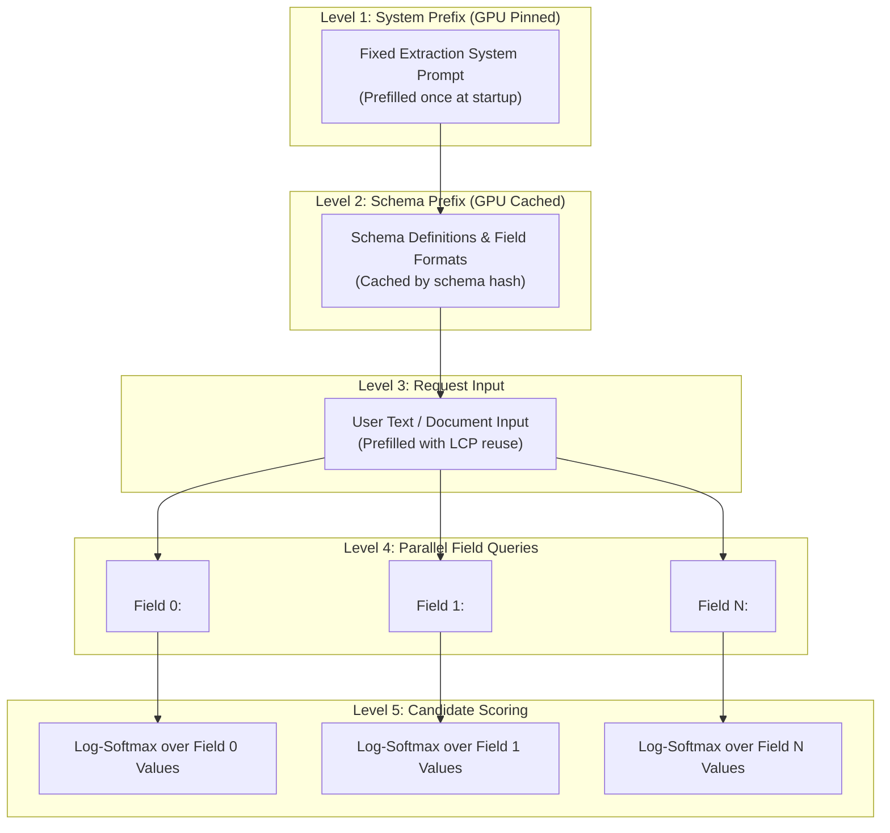

# Jev Mode: High-Speed Parallel Structured Output Engine

**Jev Mode** is DeepSeek-V4.1's ultra-high-throughput non-autoregressive structured extraction engine. It eliminates sequential token-by-token generation for schema-constrained extraction tasks, achieving **84× to 500× speedups** (917 tok/s to over 12,980 effective tok/s) while guaranteeing schema compliance.

---

## 🚀 Key Advantages

| Feature | Standard Autoregressive JSON | Jev Mode |
| :--- | :--- | :--- |
| **Decode Mechanism** | Sequential step-by-step token generation | Parallel forward pass on GPU-cached KV |
| **Decoding Steps** | $N$ tokens generated = $N$ full model passes | **1 single forward pass** for candidate scoring |
| **Latency (10 fields)** | ~4,200 ms | **~24 ms (175× speedup)** |
| **Latency (100 fields)**| ~30,700 ms | **~61 ms (500× speedup)** |
| **Throughput** | ~35 tok/s | **917 tok/s – 12,980 tok/s** |
| **Schema Compliance** | Susceptible to hallucinated fields/syntax | 100% mathematically deterministic schema |

---

## 🧠 Architectural Design: 5-Level Hierarchical Prefix Caching

Jev mode structures attention KV states into 5 immutable, hierarchical layers pinned directly in GPU VRAM:



1. **Level 1 (System Prefix)**: The core system prompt (`"You are a structured extraction engine..."`) is prefilled once when the server initializes and remains permanently in GPU cache.
2. **Level 2 (Schema Node)**: The typed JSON schema is prefilled and cached by hash. When repeated requests use the same schema, prefill time for the schema is **0 ms**.
3. **Level 3 (Request Node)**: The input prompt is evaluated with longest common prefix (LCP) acceleration.
4. **Level 4 (Parallel Field Queries)**: All field queries (`\nField 0:`, `\nField 1:`, etc.) are processed in parallel batches bounded by `max_seqs` (zero dynamic memory reallocation).
5. **Level 5 (Logit Scoring)**: Top candidate values (strings, enums, booleans, numbers) are selected via exact log-softmax scores from next-token logits without autoregressive decode.

---

## 📂 Included Demos

### 1. Real-Time Customer Feedback Analysis
Extracts sentiment, churn risk, urgency, ticket categories, and escalation requirements from raw customer reviews.
```bash
python3 examples/jev_mode/demo_customer_feedback.py
```

### 2. Batch Support Ticket Triage (Schema Cache Demo)
Processes a batch of 5 support tickets sequentially, demonstrating how the schema prefix is cached after Ticket #1:
```bash
python3 examples/jev_mode/demo_batch_extraction.py
```

### 3. Interactive CLI
Allows typing free-form text and receiving instantaneous structured JSON classifications:
```bash
python3 examples/jev_mode/demo_interactive.py
```

---

## 🔌 API Usage

Jev Mode is exposed through the standard OpenAI-compatible `/v1/chat/completions` endpoint:

```python
import urllib.request
import json

payload = {
    "model": "deepseek-v4.1-flash",
    "prompt": "Customer account acc_8812 experienced 4 payment rejections.",
    "jev": True,
    "schema": {
        "account_id": "acc_8812",
        "severity": ["low", "medium", "high", "critical"],
        "issue_type": ["payment_failure", "login_issue", "feature_bug"],
        "notify_customer": [True, False]
    }
}

req = urllib.request.Request(
    "http://127.0.0.1:8000/v1/chat/completions",
    data=json.dumps(payload).encode("utf-8"),
    headers={"Content-Type": "application/json"},
)

with urllib.request.urlopen(req) as response:
    result = json.loads(response.read().decode("utf-8"))
    print(result["choices"][0]["message"]["content"])
```

### Supported Field Types
- **Categorical / Enums**: `["optionA", "optionB", "optionC"]`
- **Booleans**: `[True, False]`
- **Integer Ranges**: `[1, 2, 3, 4, 5]`
- **Unconstrained Strings**: Defaults to top greedy token
